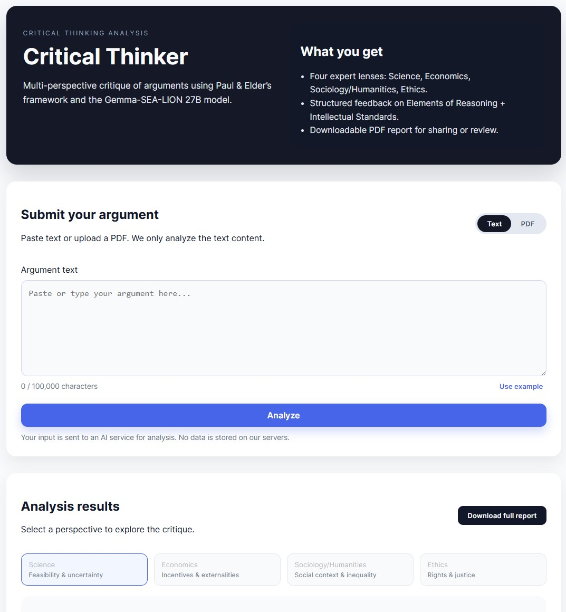
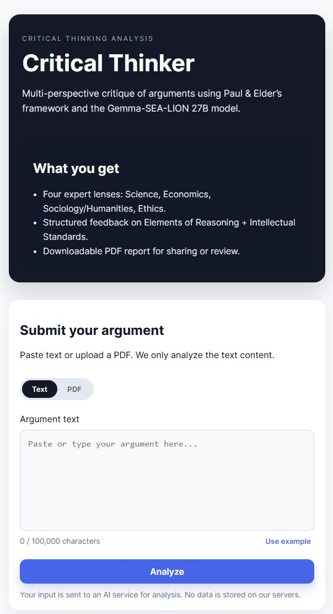

# Critical Thinker: Multi-Agent Critical Thinking Analysis (Paul & Elder Framework)

## Overview

**Critical Thinker** is a lightweight web application that supports rigorous evaluation of arguments, essays, policy proposals, and academic texts using **Paul & Elder’s Critical Thinking Framework**. The application operationalizes the framework through four independent analytical perspectives (“agents”) and produces a consolidated report that can be downloaded as a professionally formatted PDF.

The design principle is intentionally pedagogical and method-driven: the app is not a replacement for critical thinking, but a structured aid to **surface assumptions, scrutinize evidence, evaluate reasoning quality, and identify implications**—all while maintaining explicit standards of intellectual rigor.

---

<table style="border:2px solid red; border-collapse:collapse;">
  <tr>
    <td style="border:2px solid red; text-align:center; vertical-align:middle;"></td>
    <td style="border:2px solid red; text-align:center; vertical-align:middle;"></td>
  
  </tr>
</table>  

---

## Pedagogical Purpose

Critical thinking is often taught as a general skill but applied inconsistently. This app addresses a common instructional and research challenge: learners and analysts may *recognize* that an argument is weak, but struggle to pinpoint *where* it fails (e.g., unclear question at issue, missing evidence, unjustified inference, narrow point of view), or *which standard* the reasoning violates (e.g., imprecision, lack of depth, unfairness).

The app provides:

1. A **repeatable analytic workflow** aligned with a widely taught critical thinking model (Paul & Elder).
2. A structured distinction between:
   - **Elements of Reasoning** (what is present in the reasoning), and
   - **Intellectual Standards** (how well the reasoning meets quality criteria).
3. A mechanism to examine the same text from multiple disciplinary lenses, improving breadth and reducing single-perspective bias.

---

## The Critical Thinking Framework Used

Paul & Elder’s framework consists of two interacting systems:

### A. Elements of Reasoning (Structure of Thought)
These elements describe the anatomy of reasoning—what any argument, explanation, or inquiry must contain:

1. **Purpose**  
   What is the author trying to achieve? What is the intended outcome?

2. **Question at Issue**  
   What problem or question is being addressed? Is it stated clearly and precisely?

3. **Information**  
   What data, evidence, observations, or experiences are used? What is treated as fact?

4. **Concepts**  
   What theories, models, definitions, and key ideas structure the reasoning?

5. **Assumptions**  
   What is taken for granted? What must be true for the argument to hold?

6. **Inferences**  
   What conclusions are drawn from the information? Are they warranted?

7. **Implications**  
   What follows if the argument is accepted? What are likely consequences?

8. **Point of View**  
   From which perspective is the reasoning conducted? What perspectives are excluded?

A high-quality argument is not merely persuasive; it makes these elements explicit and defensible.

### B. Intellectual Standards (Quality of Thought)
These standards are criteria for evaluating reasoning. They can be applied to any element above.

1. **Clarity** — Is the meaning understandable?  
2. **Accuracy** — Is it true? Are claims correct?  
3. **Precision** — Is it sufficiently specific and detailed?  
4. **Relevance** — Does it bear directly on the issue?  
5. **Depth** — Does it address complexities and underlying structures?  
6. **Breadth** — Does it consider alternative viewpoints and contexts?  
7. **Logic** — Do conclusions follow from premises without contradiction?  
8. **Fairness** — Is the reasoning impartial and ethically attentive?

The app’s output is structured to explicitly evaluate both: the *content* of reasoning (elements) and the *quality* of reasoning (standards).

---

## Multi-Agent Analysis: Why Multiple Perspectives?

Arguments are frequently coherent within their own frame while failing when examined from adjacent frames. This application uses four independent agents to increase analytical breadth and reduce blind spots.

### 1. Science Agent — Scientific Feasibility and Uncertainty
Focus: causal plausibility, empirical support, uncertainty, confounders, measurement issues, and testability.

Typical contributions:
- distinguishing evidence from speculation
- identifying alternative explanations
- proposing tests that would strengthen or falsify claims

### 2. Economics Agent — Incentives, Trade-offs, and Externalities
Focus: incentives, costs and benefits, constraints, strategic behavior, externalities, and second-order effects.

Typical contributions:
- identifying behavioral responses to policies or interventions
- highlighting unintended consequences
- clarifying distributional trade-offs across stakeholders and time horizons

### 3. Sociology/Humanities Agent — Social Context, Norms, and Inequality
Focus: institutions, culture, legitimacy, power relations, identity, social mechanisms, and inequality.

Typical contributions:
- highlighting contextual dependence and adoption risks
- surfacing equity and inclusion implications
- examining institutional feasibility and normative conflicts

### 4. Ethics Agent — Rights, Justice, and Moral Reasoning
Focus: rights, duties, fairness, harm/benefit proportionality, consent, accountability, and governance.

Typical contributions:
- clarifying ethical assumptions and moral trade-offs
- identifying foreseeable harms and failure modes
- proposing safeguards and ethical guardrails

Each agent applies the same critical thinking framework, but emphasizes different kinds of weaknesses, risks, and boundary conditions. The goal is not to produce consensus; it is to produce a **more complete critical map** of the argument.

---

## What You Can Analyze

The app supports two input modes:

1. **Paste Text**  
   Suitable for: essays, arguments, proposals, short papers, discussion posts, statements of purpose, and policy drafts.

2. **Upload PDF**  
   Suitable for: academic papers and reports.  
   Notes:
   - The app extracts and analyzes the text content.
   - Figures are typically not interpreted as visual evidence; analysis is based on extracted text.

---

## Output: Structured Report and PDF Export

After analysis, the app produces:

- One section per agent (Science, Economics, Sociology/Humanities, Ethics)
- Within each agent:
  - **Executive Summary**
  - **Elements of Reasoning**
  - **Intellectual Standards**
  - Additional agent-specific sections (e.g., uncertainty, incentives, equity, ethical guardrails)
  - “Key Gaps & Questions to Resolve”
  - Practical recommendations or tests

You may then download a **PDF report** designed for readability and academic use (clear headings, bullet structure, consistent spacing, page numbering).

---

## Recommended Workflow

### Step 1: Provide a well-formed input
For best results, include:
- the central claim
- relevant context (audience, scope, time horizon)
- any evidence or citations you consider decisive
- constraints (resources, policy limitations, ethical constraints)

### Step 2: Read the Executive Summaries first
Use the 3–5 bullet summary from each agent to quickly identify:
- where the argument is strongest
- where it is most vulnerable
- what uncertainties dominate

### Step 3: Inspect the Elements of Reasoning
Pay special attention to:
- **Assumptions** (often implicit and contestable)
- **Information** (what is missing vs what is asserted)
- **Point of View** (often narrow or unacknowledged)

### Step 4: Apply Intellectual Standards selectively
Rather than treating all standards equally, identify the standards most relevant to your goals:
- for scientific claims: accuracy, precision, logic, depth
- for policies: breadth, relevance, fairness, implications
- for normative arguments: fairness, clarity, logic, depth

### Step 5: Use “Key Gaps & Questions” as a revision checklist
A strong revision strategy is not adding more rhetoric, but adding:
- missing evidence
- operational definitions
- alternative explanations and boundary conditions
- explicit scope and limitations

### Step 6: Use the PDF report in teaching, peer review, or self-audit
The PDF is well-suited to:
- formative feedback
- structured peer critique
- rubric design aligned to a critical thinking framework
- documenting revisions and rationale across drafts

---

## Guidance on Interpretation and Limitations

1. **Structured critique is not the same as truth evaluation**  
   The app evaluates reasoning quality and coherence; it does not guarantee factual correctness. It can flag likely issues, but verification remains essential.

2. **Outputs should be treated as hypotheses**  
   Consider the analysis as a set of critical prompts and candidate objections to be tested, not final verdicts.

3. **Framework discipline matters**  
   The app is most valuable when users treat it as an instrument for disciplined inquiry:
   - isolate claims,
   - identify evidence,
   - test assumptions,
   - and evaluate implications.

4. **Rate limits and response variability**  
   Because the app uses an external language model API, response length and phrasing may vary across runs. For high-stakes use, re-run analyses and triangulate with human review.

---

## How to Use the Application (User Instructions)

1. Open the application in a web browser.
2. Choose one input method:
   - paste text, or
   - upload a PDF.
3. Submit for analysis.
4. Review the four agent reports.
5. (Optional) Download the PDF report for sharing or archiving.

---

## Suggested Use Cases

- **Undergraduate writing support**: improving argument structure, evidentiary support, and fairness.
- **Policy memo critique**: surfacing incentives, externalities, and unintended consequences.
- **Research proposal development**: sharpening questions at issue, conceptual clarity, and methodological feasibility.
- **Ethics review preparation**: identifying rights-based risks, consent issues, and governance safeguards.
- **Interdisciplinary seminars**: comparing how different lenses stress-test the same claim.

---

## Attribution and Framework Reference

This application is grounded in the critical thinking tradition associated with **Richard Paul and Linda Elder**, particularly:

- *Elements of Reasoning* as the components of thought
- *Intellectual Standards* as criteria for assessing quality of reasoning

In an academic context, instructors may pair this tool with explicit rubric design aligned to these constructs, and require students to revise drafts by addressing specific flagged elements and standards.

---

## License and Academic Integrity Notes (Recommended)

If used in teaching and assessment contexts, it is recommended to establish a clear policy for:
- permitted vs prohibited use (formative vs summative)
- documentation of AI assistance
- expectations for citation, verification, and independent reasoning

The tool is designed to support learning and reasoning transparency, not to replace authorship or scholarly responsibility.

